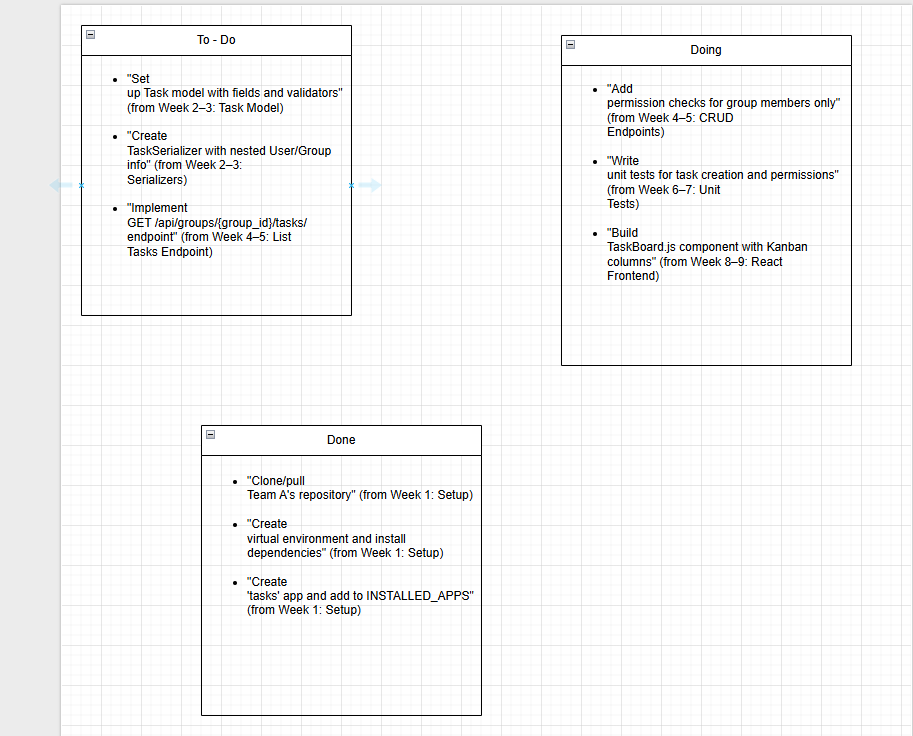

# Task Model Design

## Status Workflow
- To-Do → Doing → Done

## Fields
- id: AutoField (primary key)
- group: ForeignKey(Group)
- title: CharField(max_length=200)
- description: TextField(blank=True)
- status: CharField(choices=['todo', 'doing', 'done'], default='todo')
- due_date: DateTimeField(null=True, blank=True)
- assigned_to: ForeignKey(User, null=True, blank=True)
- created_by: ForeignKey(User)
- created_at: DateTimeField(auto_now_add=True)
- updated_at: DateTimeField(auto_now=True)

## Decisions
- Unassigned tasks allowed: Yes (for MVP)